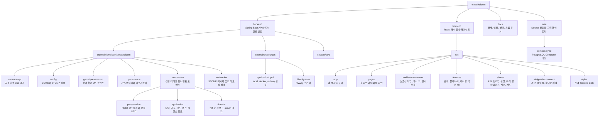
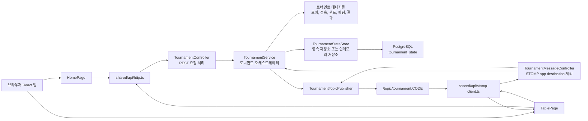
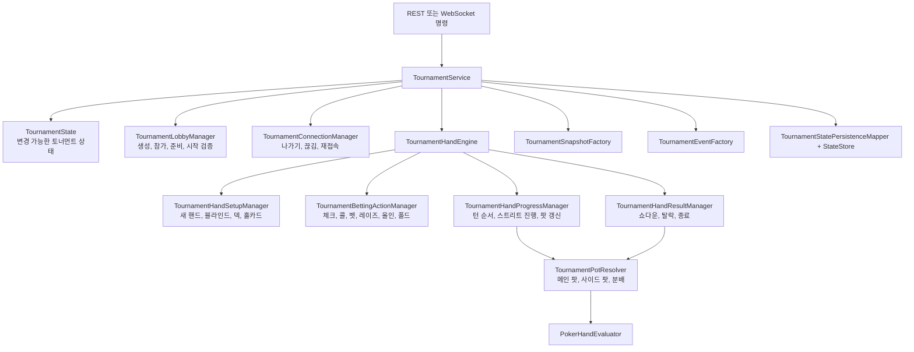
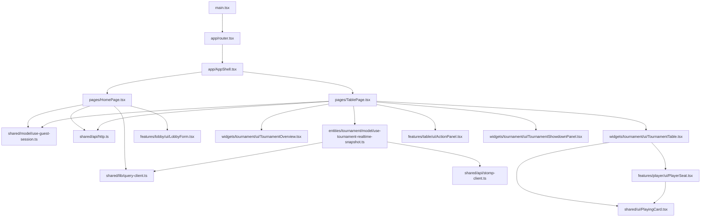

# 프로젝트 플로우차트

이 문서는 현재 프로젝트 구조와 주요 실행 흐름을 한눈에 보기 위한 요약입니다.
빌드 산출물, 의존성 폴더, IDE 파일, 로그, 임시 압축 파일은 의도적으로 제외했습니다.

## 디렉터리 맵

## 런타임 흐름

## 토너먼트 엔진 흐름

## 프론트엔드 화면 흐름

## 백엔드 파일 역할

| 파일 | 역할 |
| --- | --- |
| `backend/src/main/java/com/texasholdem/TexasHoldemApplication.java` | Spring Boot 애플리케이션 진입점입니다. |
| `backend/src/main/java/com/texasholdem/common/api/ApiResponse.java` | REST 응답을 감싸는 공통 응답 래퍼입니다. |
| `backend/src/main/java/com/texasholdem/config/CorsConfig.java` | 환경 설정 기반 CORS 정책을 구성합니다. |
| `backend/src/main/java/com/texasholdem/config/WebSocketConfig.java` | STOMP/WebSocket 엔드포인트와 브로커를 설정합니다. |
| `backend/src/main/java/com/texasholdem/game/presentation/GameStatusController.java` | 백엔드 상태 확인용 기본 엔드포인트입니다. |
| `backend/src/main/java/com/texasholdem/persistence/TournamentStateEntity.java` | 토너먼트 JSON 상태를 저장하는 JPA row 형태입니다. |
| `backend/src/main/java/com/texasholdem/persistence/TournamentStateJpaRepository.java` | 토너먼트 상태 row를 다루는 Spring Data 리포지토리입니다. |
| `backend/src/main/java/com/texasholdem/tournament/presentation/GuestController.java` | 게스트 세션 생성과 활성 토너먼트 조회 REST 엔드포인트입니다. |
| `backend/src/main/java/com/texasholdem/tournament/presentation/TournamentController.java` | 토너먼트 생성, 조회, 참가, 준비, 연결 해제, 재접속, 시작 REST 엔드포인트입니다. |
| `backend/src/main/java/com/texasholdem/tournament/presentation/dto/CreateGuestRequest.java` | 게스트 등록 요청 DTO입니다. |
| `backend/src/main/java/com/texasholdem/tournament/presentation/dto/CreateTournamentRequest.java` | 토너먼트 생성 요청 DTO입니다. |
| `backend/src/main/java/com/texasholdem/tournament/presentation/dto/JoinTournamentRequest.java` | 대기 중인 토너먼트 참가 요청 DTO입니다. |
| `backend/src/main/java/com/texasholdem/tournament/presentation/dto/TournamentReadyMessage.java` | 준비 상태 변경용 REST/STOMP payload입니다. |
| `backend/src/main/java/com/texasholdem/tournament/presentation/dto/TournamentStartMessage.java` | 토너먼트 시작 또는 다음 핸드 시작용 REST/STOMP payload입니다. |
| `backend/src/main/java/com/texasholdem/tournament/presentation/dto/TournamentConnectionMessage.java` | 연결 해제와 재접속용 REST/STOMP payload입니다. |
| `backend/src/main/java/com/texasholdem/tournament/presentation/dto/GameActionMessage.java` | 핸드 진행 중 베팅 액션용 STOMP payload입니다. |
| `backend/src/main/java/com/texasholdem/tournament/presentation/dto/TournamentRequestCodeResolver.java` | path 또는 메시지 body에서 토너먼트 코드를 정규화합니다. |
| `backend/src/main/java/com/texasholdem/websocket/TournamentMessageController.java` | `/app/...` 아래 STOMP 명령을 처리합니다. |
| `backend/src/main/java/com/texasholdem/websocket/TournamentTopicPublisher.java` | 토너먼트 이벤트를 `/topic/tournament.CODE`로 발행합니다. |
| `backend/src/main/java/com/texasholdem/tournament/application/TournamentService.java` | 토너먼트 변경을 조율하는 메인 서비스이자 동시성 경계입니다. |
| `backend/src/main/java/com/texasholdem/tournament/application/TournamentState.java` | 변경 가능한 인메모리 토너먼트 aggregate입니다. |
| `backend/src/main/java/com/texasholdem/tournament/application/TournamentPlayerState.java` | 토너먼트 내부의 플레이어별 변경 가능 상태입니다. |
| `backend/src/main/java/com/texasholdem/tournament/application/TournamentRules.java` | 좌석 수, 시작 스택, 블라인드 구조, 블라인드 헬퍼를 보관합니다. |
| `backend/src/main/java/com/texasholdem/tournament/application/TournamentStateAccess.java` | 상태 조회, 검증, 턴 순서, 사용 가능 액션 생성을 담당하는 공통 헬퍼입니다. |
| `backend/src/main/java/com/texasholdem/tournament/application/TournamentIdentityFactory.java` | 게스트 ID, 토너먼트 코드, 닉네임 정규화를 담당합니다. |
| `backend/src/main/java/com/texasholdem/tournament/application/TournamentLobbyManager.java` | 대기실 흐름인 생성, 참가, 준비, owner 시작 검증을 담당합니다. |
| `backend/src/main/java/com/texasholdem/tournament/application/TournamentOwnershipManager.java` | 플레이어가 나갈 때 owner 권한 이전 규칙을 처리합니다. |
| `backend/src/main/java/com/texasholdem/tournament/application/TournamentConnectionManager.java` | 대기실 나가기, 핸드 중 연결 해제, 재접속, 토너먼트 삭제 판단을 처리합니다. |
| `backend/src/main/java/com/texasholdem/tournament/application/TournamentHandEngine.java` | 새 핸드 시작, 액션 적용, 강제 폴드를 묶는 핸드 엔진 facade입니다. |
| `backend/src/main/java/com/texasholdem/tournament/application/TournamentHandSetupManager.java` | 생존자 정리, 버튼/블라인드, 덱, 홀카드, 프리플랍 상태를 준비합니다. |
| `backend/src/main/java/com/texasholdem/tournament/application/TournamentBettingActionManager.java` | 체크, 콜, 벳, 레이즈, 올인, 폴드 액션을 검증하고 적용합니다. |
| `backend/src/main/java/com/texasholdem/tournament/application/TournamentBetSizing.java` | 액션 검증과 UI 표시에서 쓰는 베팅 금액 계산 헬퍼입니다. |
| `backend/src/main/java/com/texasholdem/tournament/application/TournamentHandProgressManager.java` | 액션 차례, 베팅 라운드, 보드 공개, 팟 스냅샷 갱신을 진행합니다. |
| `backend/src/main/java/com/texasholdem/tournament/application/TournamentHandResultManager.java` | 핸드 정산, 탈락 처리, 결과 대기 시간, 토너먼트 종료를 처리합니다. |
| `backend/src/main/java/com/texasholdem/tournament/application/TournamentPotResolver.java` | 메인/사이드 팟 구성, 미매칭 칩 환불, 분배와 odd chip 처리를 담당합니다. |
| `backend/src/main/java/com/texasholdem/tournament/application/PokerHandEvaluator.java` | Texas Holdem 핸드를 평가하고 라벨을 만듭니다. |
| `backend/src/main/java/com/texasholdem/tournament/application/TournamentDeckFactory.java` | 덱 생성 인터페이스입니다. |
| `backend/src/main/java/com/texasholdem/tournament/application/ShuffledTournamentDeckFactory.java` | 프로덕션용 셔플된 52장 덱 구현입니다. |
| `backend/src/main/java/com/texasholdem/tournament/application/TournamentSnapshotFactory.java` | 변경 가능한 상태를 클라이언트 스냅샷과 viewer별 홀카드로 변환합니다. |
| `backend/src/main/java/com/texasholdem/tournament/application/TournamentEventFactory.java` | 상태 전환에서 이벤트 payload와 broadcast 묶음을 생성합니다. |
| `backend/src/main/java/com/texasholdem/tournament/application/TournamentBroadcast.java` | 함께 발행할 토너먼트 이벤트들의 순서 있는 묶음입니다. |
| `backend/src/main/java/com/texasholdem/tournament/application/TournamentActionResult.java` | 승인된 베팅 액션의 결과 객체입니다. |
| `backend/src/main/java/com/texasholdem/tournament/application/TournamentConnectionChange.java` | 연결 해제/재접속 변경 결과 객체입니다. |
| `backend/src/main/java/com/texasholdem/tournament/application/TournamentStateChangedEvent.java` | 자동 진행 스케줄링에 쓰는 내부 Spring 이벤트입니다. |
| `backend/src/main/java/com/texasholdem/tournament/application/TournamentResultAutoAdvanceManager.java` | 다음 핸드 자동 진행과 종료 토너먼트 정리를 스케줄링합니다. |
| `backend/src/main/java/com/texasholdem/tournament/application/TournamentStateStore.java` | 토너먼트 상태 저장을 위한 persistence port입니다. |
| `backend/src/main/java/com/texasholdem/tournament/application/InMemoryTournamentStateStore.java` | 비영속 또는 테스트 용도의 인메모리 상태 저장소 구현입니다. |
| `backend/src/main/java/com/texasholdem/tournament/application/PersistentTournamentStateStore.java` | PostgreSQL 기반 상태 저장소 구현입니다. |
| `backend/src/main/java/com/texasholdem/tournament/application/TournamentStatePersistenceMapper.java` | 변경 가능한 토너먼트 상태를 JSON으로 직렬화/역직렬화합니다. |
| `backend/src/main/java/com/texasholdem/tournament/application/BettingRound.java` | 베팅 스트리트 enum과 다음 스트리트 전환을 정의합니다. |
| `backend/src/main/java/com/texasholdem/tournament/domain/GuestSession.java` | 클라이언트에 공개되는 게스트 세션 DTO입니다. |
| `backend/src/main/java/com/texasholdem/tournament/domain/ActiveTournamentSession.java` | 활성 토너먼트 조회 결과 DTO입니다. |
| `backend/src/main/java/com/texasholdem/tournament/domain/TournamentSnapshot.java` | 클라이언트에 전달되는 토너먼트 스냅샷 계약입니다. |
| `backend/src/main/java/com/texasholdem/tournament/domain/TournamentPlayerView.java` | 스냅샷 안의 플레이어 공개 view입니다. |
| `backend/src/main/java/com/texasholdem/tournament/domain/TournamentEvent.java` | 클라이언트에 전달되는 실시간 이벤트 계약입니다. |
| `backend/src/main/java/com/texasholdem/tournament/domain/TournamentStatus.java` | 토너먼트 라이프사이클 enum입니다. |
| `backend/src/main/java/com/texasholdem/tournament/domain/PlayerStatus.java` | 플레이어 라이프사이클과 액션 상태 enum입니다. |
| `backend/src/main/java/com/texasholdem/tournament/domain/BlindLevel.java` | 블라인드 레벨 값 객체입니다. |
| `backend/src/main/java/com/texasholdem/tournament/domain/PotView.java` | 현재 메인/사이드 팟 상태의 스냅샷 view입니다. |
| `backend/src/main/java/com/texasholdem/tournament/domain/ShowdownPotView.java` | 정산된 팟 지급 내역의 스냅샷 view입니다. |
| `backend/src/main/java/com/texasholdem/tournament/domain/ShowdownPayoutView.java` | 개별 지급 대상자의 스냅샷 view입니다. |
| `backend/src/main/java/com/texasholdem/tournament/domain/ShowdownHandView.java` | 공개된 쇼다운 핸드 라벨의 스냅샷 view입니다. |

## 프론트엔드 파일 역할

| 파일 | 역할 |
| --- | --- |
| `frontend/src/main.tsx` | React 앱 진입점입니다. |
| `frontend/src/app/AppShell.tsx` | 공통 페이지 셸과 레이아웃 프레임입니다. |
| `frontend/src/app/router.tsx` | React Router 라우트 정의입니다. |
| `frontend/src/pages/HomePage.tsx` | 랜딩, 생성, 참가, 이어하기 화면입니다. |
| `frontend/src/pages/TablePage.tsx` | 토너먼트 테이블 화면과 스냅샷 오케스트레이션을 담당합니다. |
| `frontend/src/entities/tournament/model/types.ts` | TypeScript 스냅샷, 이벤트, 플레이어, 팟, 상태 계약입니다. |
| `frontend/src/entities/tournament/model/query-keys.ts` | TanStack Query 캐시 키 헬퍼입니다. |
| `frontend/src/entities/tournament/model/demo-snapshot.ts` | UI/demo 모드용 결정적 로컬 fallback 스냅샷입니다. |
| `frontend/src/entities/tournament/model/use-tournament-realtime-snapshot.ts` | WebSocket 생명주기, 재접속, REST fallback, 스냅샷 캐시 동기화를 담당합니다. |
| `frontend/src/features/lobby/ui/LobbyForm.tsx` | 생성, 참가, 이어하기 폼입니다. |
| `frontend/src/features/player/ui/PlayerSeat.tsx` | 상태, 칩, dealer/blind 배지, 홀카드를 표시하는 좌석 카드 UI입니다. |
| `frontend/src/features/table/model/action-panel.ts` | 액션 버튼 상태와 UI 패널용 금액 계산 로직입니다. |
| `frontend/src/features/table/ui/ActionPanel.tsx` | 준비, 시작, 액션, 연결 해제, 재접속 컨트롤입니다. |
| `frontend/src/widgets/tournament/ui/TournamentOverview.tsx` | 토너먼트 헤더, 동기화 상태, 레벨, 현재 플레이어, 요약 지표를 표시합니다. |
| `frontend/src/widgets/tournament/ui/TournamentTable.tsx` | 테이블 표면, 좌석 배치, 보드 카드, 팟, 결과 오버레이를 렌더링합니다. |
| `frontend/src/widgets/tournament/ui/TournamentShowdownPanel.tsx` | 정산된 팟과 쇼다운 핸드 상세를 표시합니다. |
| `frontend/src/shared/api/http.ts` | 백엔드 엔드포인트용 typed REST 클라이언트입니다. |
| `frontend/src/shared/api/stomp-client.ts` | STOMP 클라이언트 생성과 명령 발행 헬퍼입니다. |
| `frontend/src/shared/config/runtime.ts` | API와 WebSocket URL 런타임 설정입니다. |
| `frontend/src/shared/lib/query-client.ts` | TanStack Query 클라이언트 설정입니다. |
| `frontend/src/shared/model/ui-store.ts` | 공통 UI 상태 저장소입니다. |
| `frontend/src/shared/model/use-guest-session.ts` | 게스트 ID/닉네임 저장과 게스트 등록 헬퍼입니다. |
| `frontend/src/shared/ui/PlayingCard.tsx` | 카드 렌더링 컴포넌트입니다. |
| `frontend/src/styles/index.css` | Tailwind와 전역 CSS입니다. |
| `frontend/src/vite-env.d.ts` | Vite TypeScript 환경 선언입니다. |

## 리소스, 문서, 인프라, 테스트 역할

| 파일 | 역할 |
| --- | --- |
| `backend/src/main/resources/application.yml` | 공통 Spring Boot 설정 기본값과 환경 변수 바인딩입니다. |
| `backend/src/main/resources/application-local.yml` | 로컬 native PostgreSQL 프로필 설정입니다. |
| `backend/src/main/resources/application-docker.yml` | Docker 대상 프로필 설정입니다. |
| `backend/src/main/resources/application-railway.yml` | Railway 배포 프로필 설정입니다. |
| `backend/src/main/resources/db/migration/V1__init.sql` | 초기 Flyway 스키마입니다. |
| `backend/src/main/resources/db/migration/V2__tournament_state.sql` | 토너먼트 상태 영속화 스키마입니다. |
| `backend/src/test/java/com/texasholdem/TexasHoldemApplicationTests.java` | Spring context smoke test입니다. |
| `backend/src/test/java/com/texasholdem/tournament/application/TournamentServiceTest.java` | 주요 토너먼트 생명주기, 액션, 영속화, 재접속, 정산 테스트입니다. |
| `backend/src/test/java/com/texasholdem/tournament/application/TournamentBettingActionManagerTest.java` | 베팅 액션 edge case 집중 테스트입니다. |
| `backend/src/test/java/com/texasholdem/tournament/application/TournamentResultAutoAdvanceManagerTest.java` | 결과 자동 진행 스케줄링 테스트입니다. |
| `backend/src/test/java/com/texasholdem/tournament/application/PersistentTournamentStateStoreTest.java` | PostgreSQL 기반 상태 저장소 테스트입니다. |
| `backend/src/test/java/com/texasholdem/tournament/presentation/dto/TournamentRequestCodeResolverTest.java` | 요청 코드 정규화 테스트입니다. |
| `docs/setup.md` | 로컬 개발 설정 문서입니다. |
| `docs/railway.md` | Railway 배포 메모입니다. |
| `docs/spec.md` | MVP 제품 및 동작 명세입니다. |
| `docs/game-rules.md` | 포커/게임 규칙 요약입니다. |
| `docs/state-flow.md` | 토너먼트 상태 전환 메모입니다. |
| `docs/websocket-events.md` | 실시간 이벤트 계약 문서입니다. |
| `docs/roadmap.md` | 예정 작업 문서입니다. |
| `docs/status.md` | 현재 진행 상태 요약입니다. |
| `docs/structure-review.md` | 패키지/디렉터리 구조 검토와 보류된 정리 항목입니다. |
| `docs/project-flowchart.md` | 현재 프로젝트 맵과 파일 역할 인덱스입니다. |
| `infra/compose.yml` | 로컬 및 배포 지향 인프라를 위한 Docker Compose PostgreSQL 서비스입니다. |
